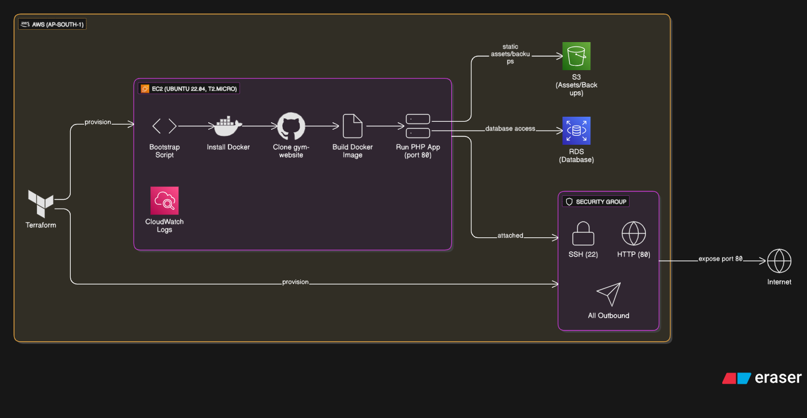
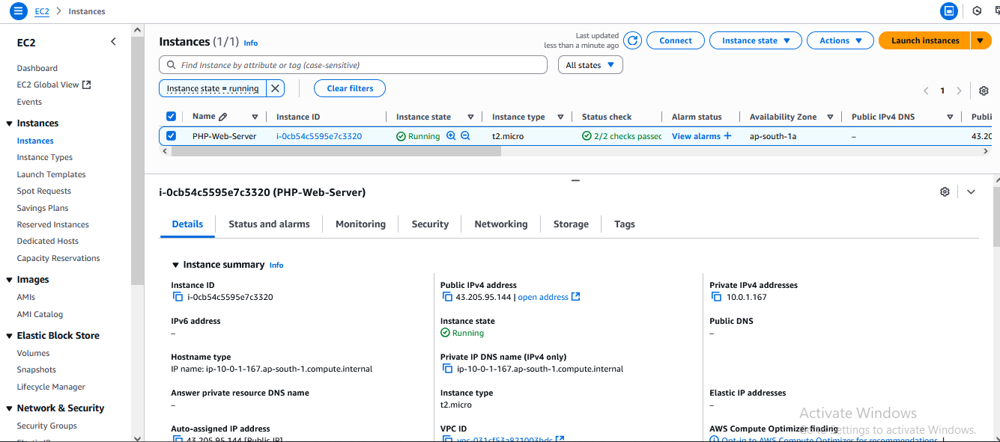
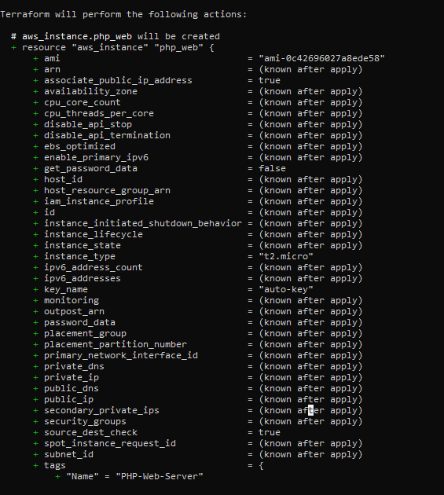
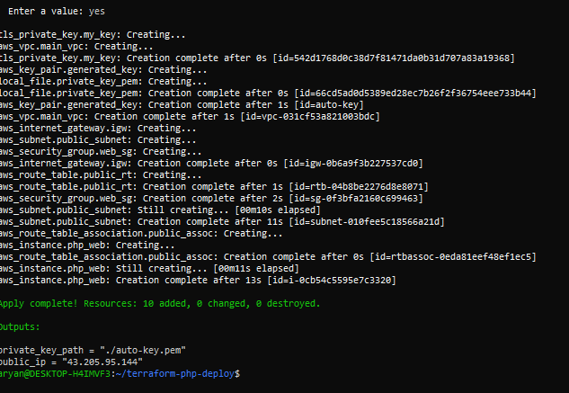
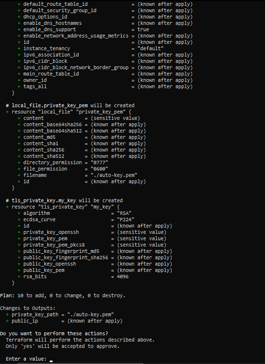

# 🚀 CI/CD Website Deployment with Terraform on AWS

This repository demonstrates a complete CI/CD workflow for deploying a website to **AWS EC2**, with the entire cloud infrastructure provisioned automatically using **Terraform**. The process is managed from a local Ubuntu server, showcasing core DevOps skills in Infrastructure as Code (IaC) and deployment automation.

---
## 🛠️ Core Technologies

-   **Cloud Provider:** Amazon Web Services (AWS)
-   **Infrastructure as Code (IaC):** Terraform
-   **Compute:** AWS EC2
-   **Web Server:** Apache2
-   **Orchestration Environment:** Ubuntu 24.04 LTS
-   **Version Control:** Git & GitHub

---
## 🧱 Architecture Overview

The architecture is designed for automation. A local Ubuntu machine, acting as the control node, runs **Terraform** to provision an **AWS EC2 instance**. This instance is configured with a web server and a security group to allow public access. Once the infrastructure is live, the website content is securely copied from the local machine to the EC2 instance, making the site publicly available.



---
## ✨ Project Showcase & Visual Guide

This visual walkthrough highlights the key stages of the project, from writing the Terraform code to the final deployed website.

### **1. The Terraform Code**
The heart of the project is the `main.tf` file, which declaratively defines all the necessary AWS resources, including the EC2 instance, security groups, and SSH key pairs.


### **2. Initializing Terraform**
The `terraform init` command prepares the working directory, downloading the necessary AWS provider plugins.


### **3. Planning the Infrastructure**
`terraform plan` creates an execution plan, showing a preview of the resources that will be created on AWS. This is a crucial step for verification.



### **4. Applying the Configuration**
`terraform apply` executes the plan, building the entire infrastructure on AWS as defined in the code.



### **5. Verifying in AWS Console**
After a successful apply, the newly created EC2 instance is visible and running in the AWS Management Console.



### **6. The Final Deployed Website**
The final step is accessing the public IP of the EC2 instance, which serves the deployed website.



---
## 📋 How to Replicate This Setup

### **1. Prerequisites**
-   An AWS account with an IAM user and configured AWS CLI (`aws configure`).
-   Terraform installed on your local machine.
-   An SSH key pair generated and its public key uploaded to AWS.

### **2. Configure Terraform Files**
-   Clone this repository.
-   Update the `provider.tf` with your desired AWS region.
-   Update the `variables.tf` or `main.tf` to specify your AMI ID, instance type, and the name of your SSH key pair.

### **3. Deploy the Infrastructure**
Run the standard Terraform workflow from your terminal.
```bash
# Initialize the Terraform workspace
terraform init

# Review the execution plan
terraform plan

# Apply the configuration to create the resources
terraform apply
```

### **4. Deploy Your Website Content**
Once the instance is running, use `scp` to securely copy your website files to the Apache webroot on the EC2 instance. You can get the instance's public IP from the Terraform output.
```bash
# Example using the 'ubuntu' user for an Ubuntu AMI
scp -i your-key.pem -r website/* ubuntu@<ec2-public-ip>:/var/www/html/
```
Your website should now be live!

---
## 👨‍💻 Author

**Aryan Sharma**
-   **B.Tech CSE (AI & DS)** | Poornima University
-   **Location:** Jaipur, Rajasthan, India
-   **GitHub:** [@AryanSharma2206](https://github.com/AryanSharma2206)
-   **LinkedIn:** [linkedin.com/in/aryan-sharma-a2a240353](https://www.linkedin.com/in/aryan-sharma-a2a240353)
